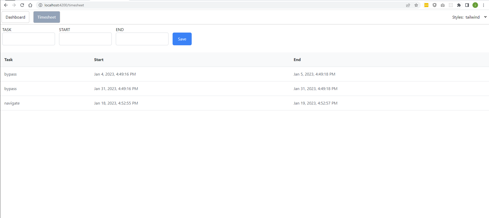

# Timesheet

Implement new page which allows user to enter time logs for the tasks he/she has done.

\- User needs to select task (using autocomplete/typeahead preferably) and enter start and end date and time.

\- Bonus task (if time allows): User should be able to see the logs he/she has entered.

---

Adding 3rd party libraries and reading documentation is allowed.

---

For time saving/convenience some libraries are preinstalled:

CSS utility:

*   TailwindCSS [https://tailwindcss.com/docs](https://tailwindcss.com/docs)
*   Bootstrap 5 [https://getbootstrap.com/docs/5.0/](https://getbootstrap.com/docs/5.0/)

Angular UI Components:

*   PrimeNg [https://www.primefaces.org/primeng/setup](https://www.primefaces.org/primeng/setup)
*   NgBootstrap [https://ng-bootstrap.github.io/#/components/accordion/api](https://ng-bootstrap.github.io/#/components/accordion/api)

---  
API base url https://63d74fd85c4274b136f1fda5.mockapi.io/api/v1

| Method | Url           | Params                             |
| ------ |:-------------:| ----------------------------------:|
| GET    | /task         | ?{fieldName}={value}               |
| GET    | /log          | ?{fieldName}={value}               |
| POST   | /log          | {start: any; end: any; task: any;} |

---

Mockup 

---

This project was generated with [Angular CLI](https://github.com/angular/angular-cli) version 15.1.3.

## Development server

Run `ng serve` for a dev server. Navigate to `http://localhost:4200/`. The application will automatically reload if you change any of the source files.

## Code scaffolding

Run `ng generate component component-name` to generate a new component. You can also use `ng generate directive|pipe|service|class|guard|interface|enum|module`.

## Build

Run `ng build` to build the project. The build artifacts will be stored in the `dist/` directory.

## Running unit tests

Run `ng test` to execute the unit tests via [Karma](https://karma-runner.github.io).

## Running end-to-end tests

Run `ng e2e` to execute the end-to-end tests via a platform of your choice. To use this command, you need to first add a package that implements end-to-end testing capabilities.

## Further help

To get more help on the Angular CLI use `ng help` or go check out the [Angular CLI Overview and Command Reference](https://angular.io/cli) page.
